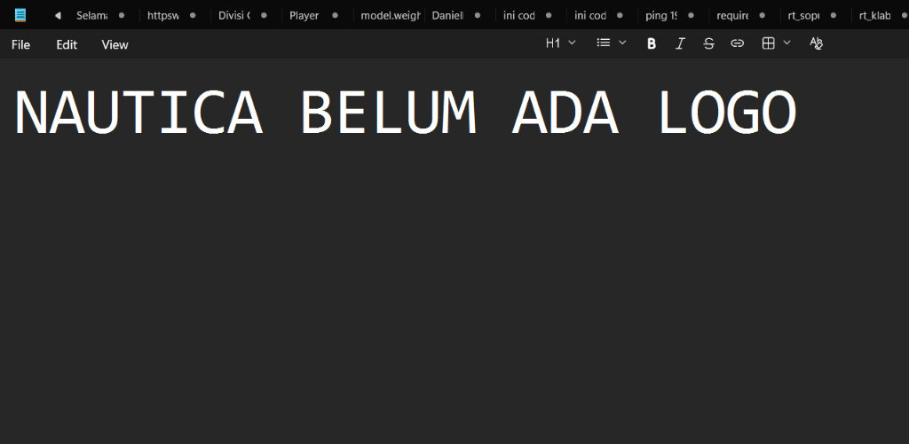

# Nautica — Cruise & Tour Booking Management System

<p align="center">
  
</p>

<p align="center">
  
  
  
  
</p>

---

## Overview

**Nautica** is a native desktop application built with Flutter, designed for managing cruise and tour bookings. It serves as an internal management tool for travel agents or tour operators who handle maritime tourism — including cruise packages, diving trips, and boat charters.

The application provides a clean, modern interface inspired by leading travel platforms such as Traveloka and Tiket.com, adapted for desktop environments (Windows & macOS).

---

## Features

### 🔐 Authentication
- Secure login and registration system
- Animated sliding panel UI (Sign In / Sign Up)
- Auto-created default admin account on first launch (`admin` / `admin123`)
- Session-based authentication gate — routes users to the dashboard after login

### 🚢 Booking Management
- Full-width desktop search bar with hover interactions
- Fields: **Depart from**, **Sail to**, **Date**, **Passengers**
- Trip type selection: **Tour**, **Diving**, **Boat**
- Create new bookings with customer name, tour date, and total price
- Update booking status: `Pending` → `Confirmed` → `Cancelled`
- Delete bookings with confirmation dialog
- Price formatting in Rupiah (Rp)

### 🎨 Design
- Light theme with purple accent (`#6C63FF`)
- Hero section with full-screen background image and dark gradient overlay
- Animated hover effects on search fields (desktop-native feel)
- Responsive card layout for booking list

---

## Tech Stack

| Layer | Technology |
|---|---|
| UI Framework | Flutter (Dart) |
| State Management | Provider |
| Database | SQLite via `sqflite_common_ffi` |
| Fonts | Google Fonts (Poppins) |
| Architecture | Feature-First |
| Target Platforms | Windows, macOS |

---

## Project Structure

```
lib/
├── core/
│   ├── constants/       # AppTheme, AppConstants
│   └── database/        # DatabaseHelper (SQLite FFI)
├── features/
│   ├── auth/
│   │   ├── models/      # User model
│   │   ├── viewmodels/  # AuthViewModel
│   │   └── views/       # LoginView
│   └── booking/
│       ├── models/      # Booking model
│       ├── viewmodels/  # BookingViewModel
│       └── views/       # BookingView
└── main.dart            # App entry point + AuthGate
```

---

## Getting Started

### Prerequisites
- Flutter SDK `>=3.0.0`
- Windows: Visual Studio 2022 with **Desktop development with C++** workload
- macOS: Xcode with Command Line Tools

### Run the App

```bash
git clone https://github.com/edwardsajaaa/nautica.git
cd nautica
flutter pub get
flutter run -d windows   # or -d macos
```

### Default Login

```
Username : admin
Password : admin123
```

---

## Screenshots

> Booking management view with desktop-style full-width search bar.

---

## License

This project is for personal and internal use. All rights reserved © 2026 Nautica.
